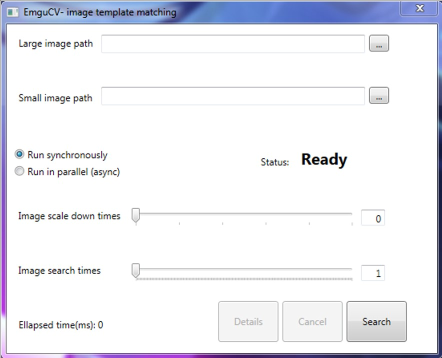
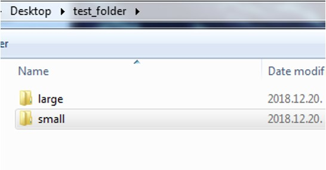
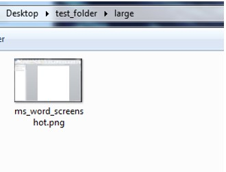
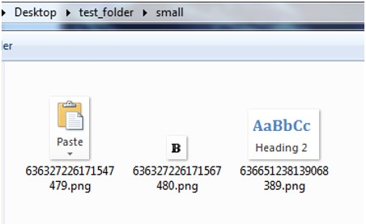
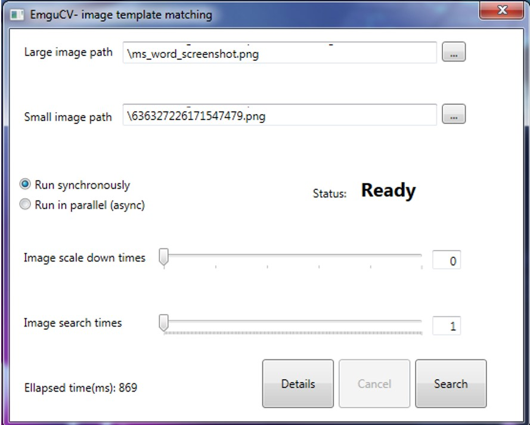
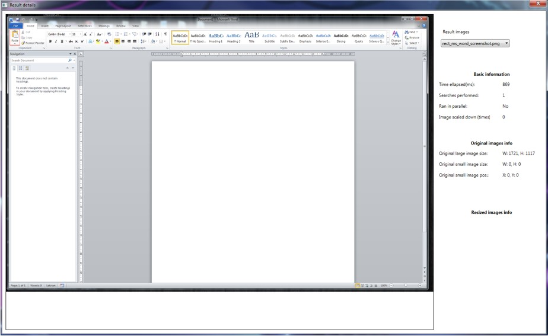
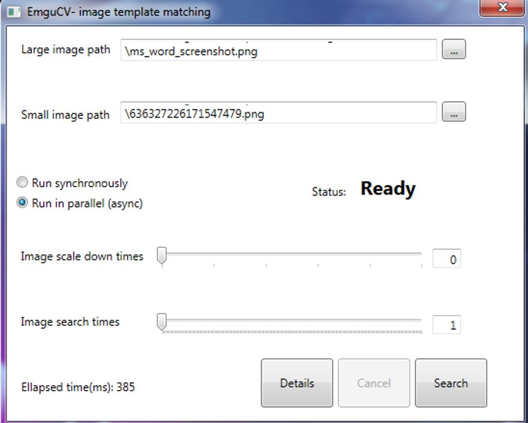
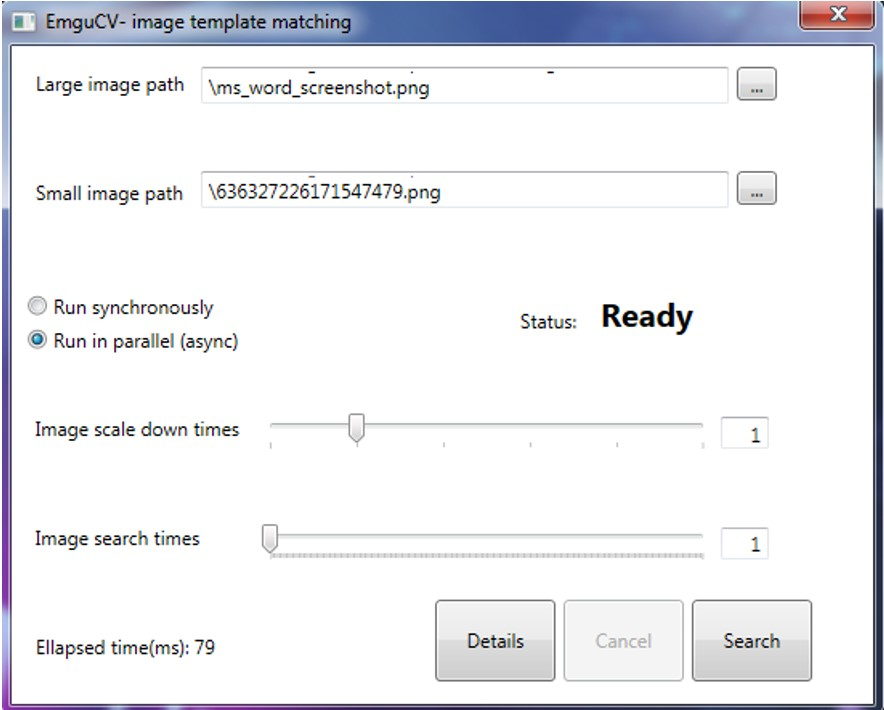
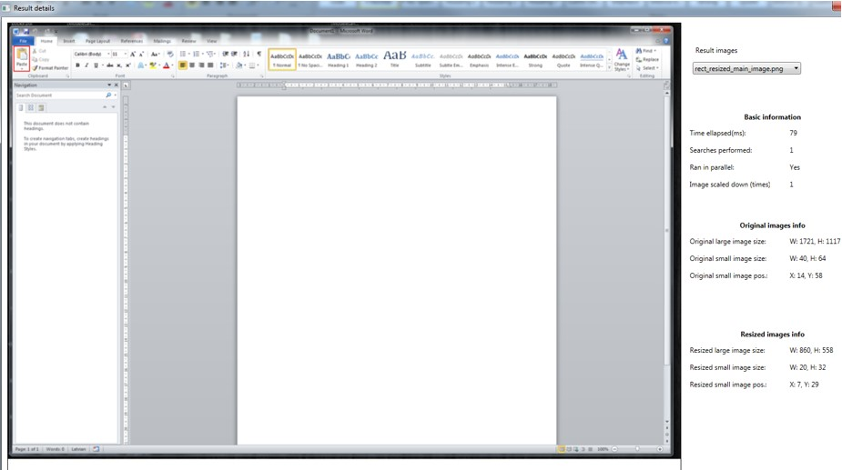
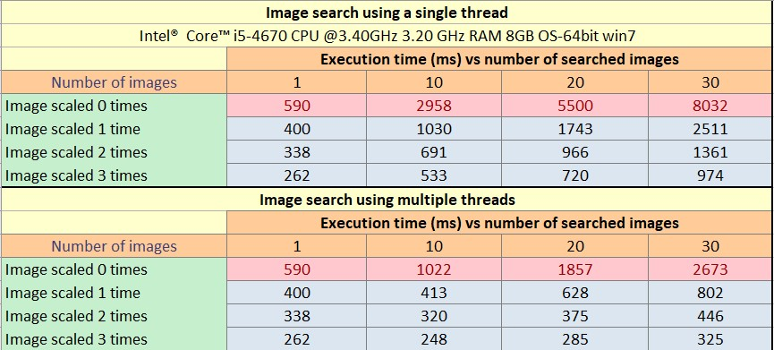

# What is this tool about?
A simple performance profiling tool that checks EmguCV image search speed via single or multiple threads. It searches a small image within larger one and draws a red rectangle in the coordinates where the image was found.
To go even further, there is used a custom image scaling functionality that scales down the images before performing the actual search. The less pixels to search, the faster the image search is!

# How does it work?
This tool is created using WPF, C# and EmguCV. It simply calls the EmguCV "MatchTemplate" function that returns a System.Drawing.Rectangle. Other part of application just handles the user inputs, scale images and run the search on either single or multiple threads.   

# Why was it created?
It was created just for curiosity, to be able to visualize the difference between execution speeds when changing different input parameters. Although, it may be quite handy if you want to measure the execution speed for specific image search scenarios including image scaling and multithreading.

# How to use it
When running the application .exe file, the following window will open: 

User selects large image and small image, the directory structure can be something like this:

As a sample for large image there is used a MS Word window screenshot.

And the MS word functions will be small images (searched in the large image).

Afer pressin the "Search" button, can see that the ellapsed time is almost 1sec for single image search.

When opening the details view can see that the function have been found in the larger image (red rectangle in top left corner).

For single image search to complete in almost a second is quite slow. To improve that we can run this search in multiple threads so that the application facilitate all the PC cores. We can see that the execution speed creately improved!

But this is not enough! Lets scale down the image and see that it completes in less than 100ms.

The smaller image again was found. Can see that the preview is quite blurry as the large image was also scaled down.

The noticable difference in performance can be seen in following table:

